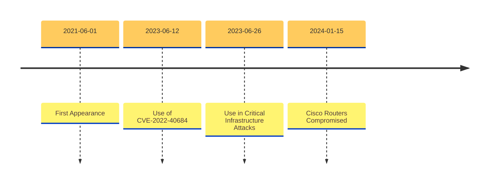

---
tags:
  - apt_briefing
artifact_type: apt_briefing
---

## VOLT TYPHOON PARENT MISSION BRIEFING

Threat Bulletin# e060121AAK

### DESCRIPTION

Volt Typhoon is a cyberespionage group that has been actively targeting critical infrastructure organizations spanning the United States, including Guam, an island with many military bases, since at least mid-2021. The targets and breached organizations belong to a wide range of key industries, including government, maritime, communications, manufacturing, information technology, utilities, transportation, construction, and education.  
  
The group's initial method of attack entails taking control of internet-exposed Fortinet FortiGuard devices by taking advantage of an unknown zero-day vulnerability. Moreover, Volt Typhoon exploits small office and home office (SOHO) network equipment from ASUS, Cisco, D-Link, Netgear, FatPipe, and Zyxel to ensure that their malicious activity blends with normal network traffic in order to avoid detection.  
  
Upon infiltrating the targets' networks, the threat actors execute living-off-the-land attacks using hands-on keyboard activities and living-off-the-land binaries (LOLBins) such as PowerShell, Certutil, Netsh, and the Windows Management Instrumentation Command-Line (WMIC). In the event that a compromised account on the Fortinet device used by Volt Typhoon has privileged access, they use that account to carry out credential access operations. Using the privileged access gained after breaching the Fortinet devices, threat actors can dump credentials via the Local Security Authority Subsystem Service (LSASS). Additionally, Volt Typhoon often tries to use the command-line tool Ntdsutil.exe to download installation files from domain controllers, either locally or remotely.  
  
Moving further, Volt Typhoon detects system information such as file system types, disk names, size, free space, running processes, and open networks. Additionally, the threat actors also use PowerShell, WMIC, and the ping tool to try and find additional machines on the compromised network. In a few circumstances, threat actors do system checks to verify whether they are functioning in a virtualized environment. In addition to the operating system and domain credentials, Volt Typhoon dumps data from local web browser applications.  
  
Post exploitation activity includes multiple techniques. Volt Typhoon leverages built-in operating system and administrator commands for the impacted device, publically available offensive tooling, such as Impacket, and third-party administrator tools and scripts, including remote management and maintenance (RMM) applications and archive tools such as 7zip and WinRAR.  
  
In the majority of cases, Volt Typhoon logs in using legitimate credentials, exactly as authorized users do. However, threat actors spoof systems occasionally to enable access via the built-in netsh portproxy command. In rare instances, they may additionally employ customized versions of the open-source programmes Impacket and Fast Reverse Proxy (FRP) to build a command-and-control (C2) channel over proxy. Organizations that have been compromised notice successful sign-ins from unusual IP addresses as evidence of C2 access.  
  
In mid-June 2023, cybersecurity researchers discovered that the Volt Typhoon campaign tries to use vulnerabilities that have patches available, mainly CVE-2022-40684, for initial access.  
  
In the last week of June 2023, Volt Typhoon was observed conducting cyber attacks against critical infrastructures by gaining initial access through ManageEngine Self-service Plus exploits. Custom web shells were used for persistent access, and living-off-the-land (LotL) techniques for lateral movement. The threat group relied on short bursts of activity involving living-off-the-land binaries to achieve its objectives. It is also suspected that Volt Typhoon deleted artifacts and tampered with the access logs to remove any forensic trails. Even though the attack method is not clear, the signs point to the exploitation of a critical authentication bypass flaw with resultant remote code execution (CVE-2021-40539).  
  
In mid-December 2023, the Volt typhoon was linked to a botnet called 'KV-botnet' that it has been using since at least 2022 to attack small office and home office (SOHO) routers in high-value targets. The botnet targets end-of-life devices used by SOHO entities that don't maintain a sound security stance. Volt typhoon is a part of a complex infection chain that involves multiple files like bash scripts (kv.sh), halting specific processes, and removing security tools running on the infected device.  
  
In mid-January 2024, cybersecurity researchers observed the Volt Typhoon threat group compromising one-third of Cisco’s vulnerable RV320/325 routers in 37 days. The campaign started in early December 2023, when these end-of-life Cisco routers and network devices were targeted in the United States, the United Kingdom, and Australia. The sales for these devices stopped in January 2020, and the threat group leveraged two Cisco vulnerabilities from 2019 to exploit the devices. The flaws, CVE-2019-1653 and CVE-2019-1652, with CVSS scores of 7.5 and 7.2, allow for unauthorized, remote access to retrieve sensitive information. Additionally, security researchers discovered a web shell that was leveraged by the threat group to maintain access to the infected devices.  
  
In early February 2024, Volt Typhoon failed to revive a botnet that was previously used in attacks targeting critical infrastructure across the United States for at least five years. Before the botnet was taken down, it allowed the Volt Typhoon threat group to proxy any malicious activity through hundreds of compromised small office/home offices (SOHO) across the US to evade detection. As per security researchers, the threat actors carried out a large-scale attack on 3,045 devices, including a third of all the NetGear ProSAFE routers exposed online globally. Out of these attempts, they managed to infect 630 devices.  
  
It is recommended to close or change the passwords for all compromised accounts, use strong passwords, impose strong multi-factor authentication (MFA) policies, harden the LSASS process, enable cloud-delivered protection, and execute endpoint detection and response (EDR) in block mode to minimize the risk of being affected by the threat.  

### Executive Summary

###### What the Security Operations needs to know

Volt Typhoon is a group that has the capabilities to perform intelligence collection and digital sabotage. It is well recognised for concentrating mostly on spying and espionage. The group appears to favor using LOTL techniques in an effort to obtain credentials in the course of post-compromise activity rather than using malware very often. These LOTL tactics include the use of authorized networking utilities preloaded on operating systems to hide their actions, like certutil, ntdsutil, xcopy, and others.  
  
Volt Typhoon is claimed to be working on developing capabilities that might disrupt crucial communications infrastructure between the United States and the Asia region during the possibility of an unforeseen crisis. One of Volt Typhoon's key tactics, techniques, and procedures (TTPs) is employing existing cyber management technologies to achieve its goals. Using this TTP, threat actors can minimize the amount of activity that is recorded in default log configurations, dodge warnings brought on by third-party applications to servers by EDR solutions, and pass undetected by blending in with regular Windows system and network operations.  
  
The security operations of an organization are recommended to harden domain controllers, monitor event logs for ntdsutil.exe and related process creations, restrict port proxy usage within environments, examine unusual IP addresses and ports in command lines, analyze perimeter firewall configurations for unauthorized changes, and transmit log files to a hardened centralized logging server to overcome the threats posed by Volt Typhoon.  
  

###### What the IT Operations needs to know

CVE-2021-40539 - Zoho ManageEngine ADSelfService Plus  
CVE-2022-40684 - An authentication bypass using an alternate path or channel in Fortinet FortiOS enables threat actors to conduct operations on the administrative interface.  

Highlight

ALE $64.7K

PLEF 3.7

|   |   |
|---|---|
|Created|06/01/2021|
|Last updated|02/09/2024|

###### Affected Sectors

PUBLIC SECTOR, INFORMATION AND COMMUNICATION, MANUFACTURING, UTILITY, TRANSPORTATION, CONSTRUCTION

###### Affected Cities

US.ENTERPRISE, NORTH AMERICA.ENTERPRISE, OCEANIA.CONSUMER, AU.ENTERPRISE, EUROPE.CONSUMER, GB.ENTERPRISE

###### Campaign Timeline

CYBER ASSETS

### A2 - Technical Details

Volt Typhoon is a threat actor group that has been widely exploiting external-facing services and network appliances since 2021. The main goal of the group's operations is to gain initial access to externally facing services and appliances. This enables the threat actor to connect directly to the internal networkA of vital infrastructure. The observed applications and services involve Zoho ManageEngine ADSelfService Plus (CVE-2021-40539), Paessler PRTG monitoring software, and Fortinet FortiGuard devices.  The threat actors allegedly target vulnerabilities in a number of SOHO networking and security appliances to compromise equipment before using these targets as relay points for affected endpoints. Items identified in the public disclosure include, although are not limited to, ASUS, Cisco, D-Link, Netgear, and Zyxel equipment. The threat actors discover high-level AD credentials on these compromised devices, which provide them instant access to the DC and other domain-related services. This enables them to swiftly obtain high-level clearance rights and start launching persistent attacks.  The threat actors then look for information about the system, such as file system kinds, drive names, sizes, and available space, as well as active processes and open networks. To find other systems on the infected network, they additionally employ WMIC commands and pinging. Moving forward, the threat actor tries to steal the SYSTEM registry hive and ntds.dit file from Windows DCs so they can be used to crack passwords outside of the network. Although the ntds.dit file is locked while it is being used by AD, a copy can be generated by generating a volume shadow copy and extracting the ntds.dit file out of the shadow copy.  Once within the internal network, the threat actors' aim is not to interfere with its operations, instead trying to blend in with the environment as much as they can, steal relevant information, and look for opportunities. Threat actors therefore employ various living-off-the-land strategies and hands-on keyboard activities to evade potential discovery, wipe off various traces, and hide their network trails through proxies. Later, they go on to investigate additional existing services, access more data, and acquire more credentials. The threat actors also utilize the PortProxy add command to build a host:port proxy that routes inbound connections from the listenaddress and listenport supplied to the connectaddress and connectport.  The group further employs the PowerShell command to identify successful logons to the host. This command determines the user account they are currently using to access the network, identifies other users who are logged in to the host, and analyzes how their actions are being logged. Additionally, the threat actors frequently use Impacket's wmiexec, which directs output to a file on the target host's ADMIN$ share with an epoch timestamp in its name.   

### A3 - MITRE ATTACK

Reconnaissance

Resource Development

Initial Access

|Sub-Techniques|Details of Techniques Used|Counter Measures||
|---|---|---|
|T1190.000 - EXPLOIT PUBLIC-FACING APPLICATION|Threat actors attempt to exploit a weakness in an Internet-facing host or system to initially access a network.|D3-PHDURA - Per Host Download-Upload Ratio Analysis||
|T1190.000 - EXPLOIT PUBLIC-FACING APPLICATION|Threat actors attempt to exploit a weakness in an Internet-facing host or system to initially access a network.|D3-CSPP - Client-server Payload Profiling||
|T1190.000 - EXPLOIT PUBLIC-FACING APPLICATION|Threat actors attempt to exploit a weakness in an Internet-facing host or system to initially access a network.|D3-RTSD - Remote Terminal Session Detection||
|T1190.000 - EXPLOIT PUBLIC-FACING APPLICATION|Threat actors attempt to exploit a weakness in an Internet-facing host or system to initially access a network.|D3-DQSA - Database Query String Analysis||
|T1190.000 - EXPLOIT PUBLIC-FACING APPLICATION|Threat actors attempt to exploit a weakness in an Internet-facing host or system to initially access a network.|D3-ISVA - Inbound Session Volume Analysis||
|T1190.000 - EXPLOIT PUBLIC-FACING APPLICATION|Threat actors attempt to exploit a weakness in an Internet-facing host or system to initially access a network.|D3-PSEP - Process Segment Execution Prevention||
|T1190.000 - EXPLOIT PUBLIC-FACING APPLICATION|Threat actors attempt to exploit a weakness in an Internet-facing host or system to initially access a network.|D3-PMAD - Protocol Metadata Anomaly Detection||
|T1190.000 - EXPLOIT PUBLIC-FACING APPLICATION|Threat actors attempt to exploit a weakness in an Internet-facing host or system to initially access a network.|D3-UGLPA - User Geolocation Logon Pattern Analysis||

Execution

|Sub-Techniques|Details of Techniques Used|Counter Measures||
|---|---|---|
|T1059.001 - COMMAND AND SCRIPTING INTERPRETER: POWERSHELL|Threat actors abuse PowerShell commands and scripts for execution.|D3-DF - Decoy File||
|T1059.001 - COMMAND AND SCRIPTING INTERPRETER: POWERSHELL|Threat actors abuse PowerShell commands and scripts for execution.|D3-DA - Dynamic Analysis||
|T1059.001 - COMMAND AND SCRIPTING INTERPRETER: POWERSHELL|Threat actors abuse PowerShell commands and scripts for execution.|D3-EFA - Emulated File Analysis||
|T1059.001 - COMMAND AND SCRIPTING INTERPRETER: POWERSHELL|Threat actors abuse PowerShell commands and scripts for execution.|D3-EAL - Executable Allowlisting||
|T1059.001 - COMMAND AND SCRIPTING INTERPRETER: POWERSHELL|Threat actors abuse PowerShell commands and scripts for execution.|D3-EDL - Executable Denylisting||

Persistence

|Sub-Techniques|Details of Techniques Used|Counter Measures||
|---|---|---|
|T1505.003 - Web Shell|Threat actors backdoor web servers with web shells to establish persistent access to systems.|D3-PLA - Process Lineage Analysis||
|T1505.003 - Web Shell|Threat actors backdoor web servers with web shells to establish persistent access to systems.|D3-PSMD - Process Self-Modification Detection||
|T1505.003 - Web Shell|Threat actors backdoor web servers with web shells to establish persistent access to systems.|D3-EAL - Executable Allowlisting||
|T1505.003 - Web Shell|Threat actors backdoor web servers with web shells to establish persistent access to systems.|D3-PSA - Process Spawn Analysis||
|T1505.003 - Web Shell|Threat actors backdoor web servers with web shells to establish persistent access to systems.|D3-EDL - Executable Denylisting||
|T1505.003 - Web Shell|Threat actors backdoor web servers with web shells to establish persistent access to systems.|D3-MAC - Mandatory Access Control||
|T1505.003 - Web Shell|Threat actors backdoor web servers with web shells to establish persistent access to systems.|D3-DA - Dynamic Analysis||
|T1505.003 - Web Shell|Threat actors backdoor web servers with web shells to establish persistent access to systems.|D3-DF - Decoy File||

Privilege Escalation

|Sub-Techniques|Details of Techniques Used|Counter Measures||
|---|---|---|
|T1546.007 - Netsh Helper DLL|Threat actors establish persistence by executing malicious content triggered by the execution of tainted binaries.|D3-MAC - Mandatory Access Control||
|T1546.007 - Netsh Helper DLL|Threat actors establish persistence by executing malicious content triggered by the execution of tainted binaries.|D3-PSA - Process Spawn Analysis||
|T1546.007 - Netsh Helper DLL|Threat actors establish persistence by executing malicious content triggered by the execution of tainted binaries.|D3-PSMD - Process Self-Modification Detection||
|T1546.007 - Netsh Helper DLL|Threat actors establish persistence by executing malicious content triggered by the execution of tainted binaries.|D3-HBPI - Hardware-based Process Isolation||
|T1546.007 - Netsh Helper DLL|Threat actors establish persistence by executing malicious content triggered by the execution of tainted binaries.|D3-PLA - Process Lineage Analysis||

Defense Evasion

Credential Access

Discovery

Lateral Movement

Collection

Command and Control

|Sub-Techniques|Details of Techniques Used|Counter Measures||
|---|---|---|
|T1090.002 - External Proxy|Threat actors use an external proxy to act as an intermediary for network communications to a command and control server to avoid direct connections to their infrastructure.|D3-PHDURA - Per Host Download-Upload Ratio Analysis||
|T1090.002 - External Proxy|Threat actors use an external proxy to act as an intermediary for network communications to a command and control server to avoid direct connections to their infrastructure.|D3-RTSD - Remote Terminal Session Detection||
|T1090.002 - External Proxy|Threat actors use an external proxy to act as an intermediary for network communications to a command and control server to avoid direct connections to their infrastructure.|D3-CSPP - Client-server Payload Profiling||
|T1090.002 - External Proxy|Threat actors use an external proxy to act as an intermediary for network communications to a command and control server to avoid direct connections to their infrastructure.|D3-PMAD - Protocol Metadata Anomaly Detection||
|T1090.002 - External Proxy|Threat actors use an external proxy to act as an intermediary for network communications to a command and control server to avoid direct connections to their infrastructure.|D3-NTCD - Network Traffic Community Deviation||
|T1090.002 - External Proxy|Threat actors use an external proxy to act as an intermediary for network communications to a command and control server to avoid direct connections to their infrastructure.|D3-UGLPA - User Geolocation Logon Pattern Analysis||

Exfiltration

Impact

No Data Available.